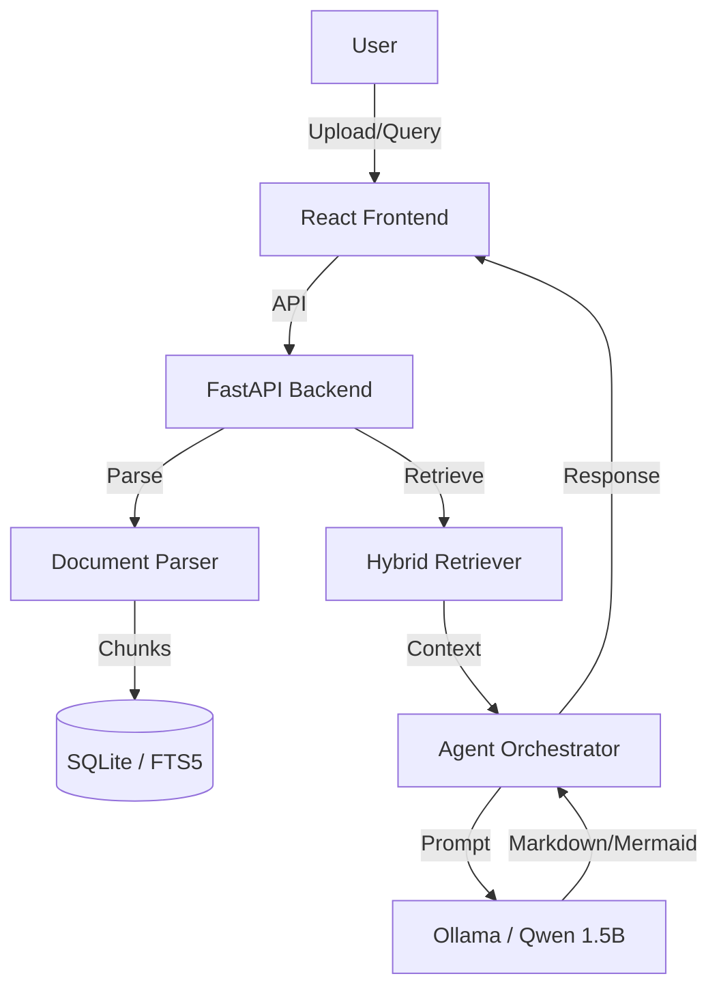

# ExamLens: Technical Design & Implementation Blueprint

## SECTION 1 — PRODUCT DEFINITION
- **App Name**: ExamLens
- **One-line Vision**: A local-first AI study assistant that transforms complex documents into grounded, exam-ready answers and structured notes using lightweight local LLMs.
- **Target Users**: University students, competitive exam aspirants, and lifelong learners.
- **Primary Use Cases**: Revision from textbooks, mock exam answer generation, chapter summary creation, and flowchart generation.
- **Non-Goals**: General creative writing, real-time web search, multi-user collaboration (v1), or handling extremely large datasets (10GB+).
- **Difference from Generic PDF Chat**: Generic apps provide conversational fluff. ExamLens enforces strict exam formats (2/5/10 marks), provides structured citations, and uses CAG (Context-Augmented Generation) to maintain consistency across a session without re-reading the whole doc.
- **Why Exam-Oriented Matters**: Students often understand the material but fail to structure it for maximum marks. ExamLens bridge the gap between "understanding" and "exam presentation."

## SECTION 2 — CORE FEATURES
### Mandatory Features:
- **Multi-Format Ingestion**: PDF, DOCX, TXT, MD, and manual paste.
- **Semantic + Lexical Indexing**: Hybrid retrieval for high precision on technical terms.
- **Exam Mode Answer Formatting**:
  - **1-Line/Definition**: Extremely concise.
  - **Short Answer (2-5 marks)**: Bulleted, definition-first.
  - **Long Answer (10-15 marks)**: Structured with headings, intro, points, and conclusion.
  - **Comparison Table**: Side-by-side differences.
- **Notebook Mode (CAG)**:
  - **Auto-Summary**: Generated per chapter.
  - **Concept Cards**: Definition + Importance.
  - **Viva/Quiz Prep**: Probable questions based on document density.
- **Diagram Generation**: Mermaid.js flowcharts and mindmaps derived from procedural or hierarchical text.
- **Grounded Citations**: Every claim linked to [Doc:Page] or [Doc:Chunk].
- **Local-Only**: Zero data leaves the machine. Uses Ollama + Qwen 1.5B.

## SECTION 3 — SYSTEM ARCHITECTURE
### High-Level Stack
- **Frontend**: React 18, Tailwind CSS, Lucide Icons, Mermaid.js.
- **Backend**: FastAPI (Python 3.10+).
- **LLM Runtime**: Ollama.
- **Model**: `qwen2.5:1.5b-instruct` (Highly optimized for structured output).
- **Retrieval Engine**: SQLite FTS5 (Lexical) + Simple Vector Index (Semantic).
- **Parser**: `PyMuPDF` (PDF), `python-docx` (Word).
- **Storage**: SQLite for metadata, chat history, and cached notes.

### Architecture Diagram (Conceptual)


## SECTION 4 — AGENTIC WORKFLOW
For a 1.5B model, a **Modular Single Orchestrator** is superior to a Multi-Agent Swarm.
- **Role**: The Orchestrator parses the user intent (e.g., "Give me 5 marks on X") and selects the tool/prompt template.
- **Input**: User query + Conversation context.
- **Output**: Structured response (JSON/Markdown).
- **Optimization**: Use "Few-Shot String Templates" rather than asking the model to "think" about which tool to use.

## SECTION 5 — RAG + CAG STRATEGY
### The Hybrid Pipeline
1. **Chunking**: Fixed-size chunks (1500 chars) with 200-char overlap. Paragraph-aware splitting.
2. **Retrieval**:
   - **Lexical (FTS5)**: Finds exact terms (crucial for exams).
   - **Semantic**: Finds conceptual matches.
   - **Re-ranking**: Simple scoring (Reciprocal Rank Fusion) of top 10 results.
3. **CAG (Context-Augmented Generation)**:
   - **Pre-computed Pack**: On ingestion, generate a 500-word summary and "Key Concepts" list.
   - **Reuse**: For repeated queries on the same topic, send the "Pre-computed Pack" + top 3 relevant chunks to save context window.

## SECTION 6 — PROMPT ENGINEERING
### Exam Writer Prompt (Internal)
```text
System: You are a strict exam assistant. Use ONLY provided context.
User: Question: {query}
Mode: {mark_count} marks.
Context: {context}
Constraint: Format as:
1. Definition
2. Key Points (Bulleted)
3. Conclusion
Citations: [doc:chunk_id]
```

## SECTION 7 — UI/UX DESIGN
- **Layout**: Three-pane view.
  - **Left**: Document Library & Session History.
  - **Center**: Chat / Answer Area.
  - **Right**: "Study Brief" (Mermaid diagrams & Generated Notes).
- **Theme**: "Scholar Light" (Cream paper background) or "Focus Dark".

## SECTION 8 — DATABASE SCHEMA (SQLite)
```sql
CREATE TABLE documents (id TEXT PRIMARY KEY, title TEXT, raw_text TEXT, metadata JSON);
CREATE TABLE chunks (id TEXT PRIMARY KEY, doc_id TEXT, content TEXT, page_num INT);
CREATE TABLE sessions (id TEXT PRIMARY KEY, name TEXT, created_at DATETIME);
CREATE TABLE messages (id TEXT PRIMARY KEY, session_id TEXT, role TEXT, content TEXT, mode TEXT);
CREATE TABLE cached_notes (id TEXT PRIMARY KEY, doc_id TEXT, topic TEXT, content TEXT);
```

## SECTION 9 — API DESIGN
- `POST /api/v1/ingest`: Upload file -> Returns `doc_id`.
- `POST /api/v1/ask`: `{ query, mode, session_id, doc_ids }` -> Returns `{ answer, citations, diagram_code }`.
- `GET /api/v1/notes/{doc_id}`: Fetches pre-computed CAG notes.

## SECTION 10 — IMPLEMENTATION PLAN
1. **Phase 1 (MVP)**: Basic PDF parsing, SQLite indexing, and simple Q&A.
2. **Phase 2 (Exam Mode)**: Implementation of 2/5/10 mark prompt templates and citation logic.
3. **Phase 3 (CAG & Notes)**: Ingestion-time summarization and "Study Brief" sidebar.
4. **Phase 4 (Visuals)**: Mermaid.js integration for flowcharts.
5. **Phase 5 (Polishing)**: Export to PDF/MD and UI refinements.

## SECTION 11 — REPO STRUCTURE
```text
examlens/
├── backend/
│   ├── src/examlens/api/      # FastAPI Routes
│   ├── src/examlens/core/     # RAG/CAG Logic
│   └── tests/
├── frontend/
│   ├── src/components/        # UI Components
│   └── src/hooks/             # API Interactivity
├── data/                      # Local SQLite & Uploads
└── scripts/                   # Setup & Model Pull
```

## SECTION 12 — SMALL MODEL OPTIMIZATION
- **Temperature**: 0.1 (Strictness).
- **Context Limiting**: Max 4 chunks (approx 2000 tokens) to avoid Qwen 1.5B "forgetting" instructions.
- **Template-Based**: Instead of "Write an essay," use "Write 3 bullets about X."

## SECTION 13 — FLOWCHART LOGIC
- **Trigger**: Detect keywords like "process," "cycle," "evolution," "steps."
- **Extraction**: Ask Qwen to list steps as `Step 1 -> Step 2`.
- **Transformation**: Regex-based wrap into `graph TD`.

## SECTION 14 — OPEN-SOURCE ENGINEERING
- **License**: MIT.
- **README**: Focus on "Privacy" and "Offline-first."
- **Docker**: Optional but recommended for easy setup.

## SECTION 15 — TESTING STRATEGY
- **Grounding Test**: Query the model on a fake fact; verify it says "Not found."
- **Performance**: Measure time-to-first-token on CPU.

## SECTION 16 — SECURITY
- No telemetry.
- Localhost binding only.

## SECTION 17 — OUTPUT DELIVERABLES
1. Full source code for Backend (FastAPI).
2. Full source code for Frontend (React).
3. Pre-configured Ollama prompt templates.
4. Deployment script `setup.sh`.
